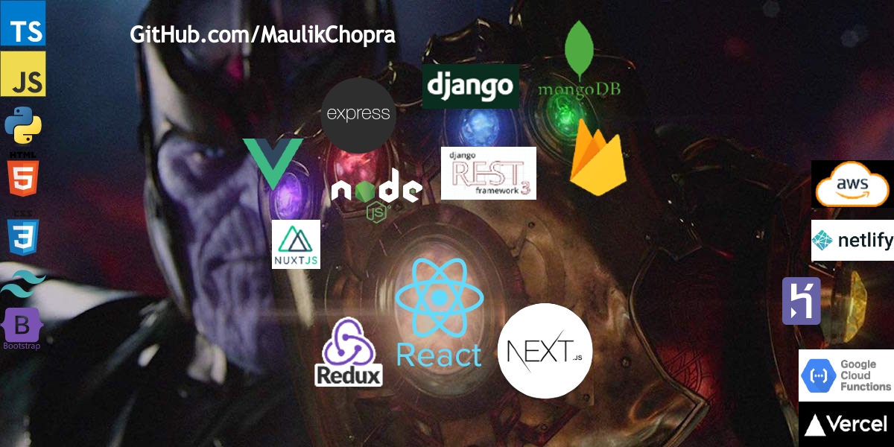
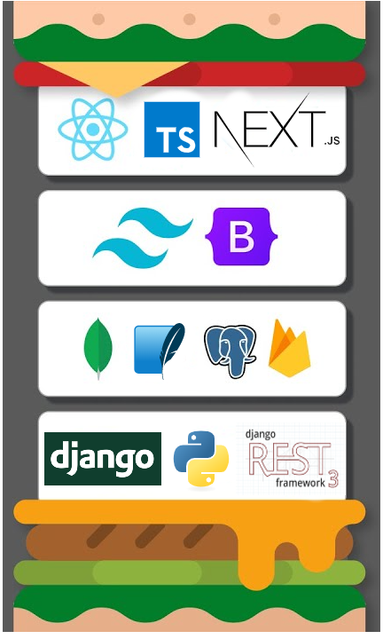

<!-- MAIN CONTENT -->

# Hi 👋, I'm Maulik Chopra

### A passionate Full-Stack Web Developer 💻 | Mobile App Developer 📱 | AI Enthusiast 🤖 | Entrepreneur 🚀 | Founder of 9 Minute Reads 📚 | Building Scalable Solutions with React, Django, Python, & AI 🌟

Maulik Chopra is a passionate and results-driven software engineer specializing in full-stack web development, mobile applications, and AI-powered solutions. With a strong foundation in Python, JavaScript, React.js, Django, and React Native, Maulik has demonstrated an impressive ability to deliver scalable, high-impact projects across various domains.

As the Founder and Lead Developer of 9 Minute Reads, Maulik designed and developed a generative AI-powered book summary platform, creating a website and cross-platform mobile apps with 6,000+ book summaries and AI-powered recommendations. He led a team of 5 developers, attracting investment offers worth 5 figures and driving product growth. Maulik has proven his entrepreneurial acumen through the development of innovative solutions that are transforming how users engage with content.

Maulik’s experience also includes founding AssistCheck.org, a technology consulting startup, where he developed custom websites and software for 10+ NGOs, enhancing their digital presence and engagement by 300%. His expertise in transitioning organizations from paper-based systems to digital solutions significantly improved operational efficiency.

Throughout his career, Maulik has worked on diverse projects, including the Book Reading Mobile App and Website, where he implemented 25+ UI screens, integrated 6,000+ images, and delivered AI-generated book content comprising over 2 million words in just 2 months. He has also built a Twitter Clone with 15+ UI pages, completing backend integration in 1 month.

With additional experience in AWS, Google Cloud, Firebase, and OpenAI API, Maulik is committed to staying ahead of the curve in tech innovation. He is eager to apply his skills and continue delivering impactful, scalable solutions in full-stack web development, data analytics, and AI-driven applications.

- 📄 Know about my experiences in **[My LinkedIn](https://www.linkedin.com/in/maulik-chopra/).**

---

### My Technology Expertise:

### Languages I am Proficient at:

    <!-- PYTHON -->
    
    <!-- TYPESCIPT -->
    
    <!-- JAVASCRIPT -->
    
    <!-- HTML -->
    
    <!-- CSS -->
    
<!-- ### Languages I am comfortable with: -->
    <!-- ARDUINO -->
     
    <!-- JAVA -->
    

### Frontend Technologies I Rock at:

    <!-- REACT.JS -->
    
    <!-- NEXT.JS -->
     
    <!-- REDUX -->
    
    <!-- TAILWIND CSS -->
    
    <!-- BOOTSTRAP -->
    

### Backend Technologies I Rock at:

    <!-- DJANGO -->
    
    <!-- DJANGO REST FRAMEWORK -->
     
    <!-- NODE.JS -->
    
    <!-- FIREBASE -->
    

### Databases I love:

<!-- PostgreSQL -->

    
    <!-- MONGODB -->
    
    <!-- FIREBASE -->
    

<!-- TOOLS I USE TO CODE -->

### My Tools:

    <!-- LINUX -->
    
    <!-- GIT -->
    
    <!-- DOCKER -->
    
    <!-- WEBPACK -->
    
    <!-- HEROKU -->
       
    <!-- POSTMAN -->
    
    <!-- AMAZON WEB SERVICES AWS -->
    

---
<!--
### My Top projects:

| Project Name                                                                           | TechStack                                           | Repo                                                                          |
| -------------------------------------------------------------------------------------- | --------------------------------------------------- | ----------------------------------------------------------------------------- |
| [Daily dose of quotes Twitter Bot](https://www.twitter.com/BotTweetsQuotes)            | TwitterAPI, NoSQL database & Heroku.                | [GitHub](https://www.github.com/MaulikChopra/Daily-dose-of-quotes-bot-PUBLIC) |
| [Email service website](https://mail-cs50web.herokuapp.com/)                           | Django, HTML, CSS, JavaScript, PostgreSQL & Heroku. | [GitHub](https://github.com/MaulikChopra/mail-cs50web)                        |
| [Auctionaire](https://auctions-cs50web.herokuapp.com/)                                 | Django, HTML, CSS, Server side rendering & Heroku.  | [GitHub](https://www.github.com/MaulikChopra/auctions-cs50web)                |
| [Google Search Clone ](https://maulikchopra.github.io/google-clone-cs50web/index.html) | HTML, CSS & GitHub Actions                          | [GitHub](www.github.com/MaulikChopra/google-clone-cs50web)                    |

### My Tech Stack

  

---

 LANGUAGES STATS CARD -->

---

### My latest coding blogs

<!-- BLOG-POST-LIST:START 
- [Check if the parenthesis/brackets in a string are balanced or not. Python and stack Data Structures](https://medium.com/@maulikchopra/check-if-the-parenthesis-brackets-in-a-string-are-balanced-or-not-python-and-stack-data-structures-33ed6ae58c00?source=rss-1d49c6d49e80------2)
- [How to implement a Queue class using deque. PYTHON data structures and algorithm.](https://medium.com/@maulikchopra/how-to-implement-a-queue-class-using-deque-python-data-structures-and-algorithm-37531e1ff7e3?source=rss-1d49c6d49e80------2)
- [How to implement a stack class and deque. PYTHON data structures and algorithm.](https://medium.com/@maulikchopra/how-to-implement-a-stack-class-and-deque-python-data-structures-and-algorithm-5aa601f2d063?source=rss-1d49c6d49e80------2)
- [How to implement Binary Search in PYTHON. Binary Search code with recursion and iteration.](https://medium.com/@maulikchopra/how-to-implement-binary-search-in-python-binary-search-code-with-recursion-and-iteration-cd03567cf70e?source=rss-1d49c6d49e80------2)
BLOG-POST-LIST:END -->

### Connect with me

  <!-- MAIL -->
  
  <!-- LINKEDIN -->
  
  <!-- GITHUB -->
  
  <!-- MEDIUM
  
YOUTUBE
  
INSTAGRAM 
  
TWITTER 
  
  <!-- STACKOVERFLOW 
  
  <!-- LEETCODE -->
  

