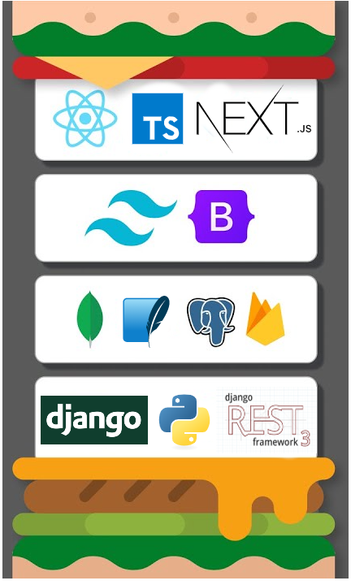

<!-- MAIN CONTENT -->

<h1 align="center">Hi 👋, I'm Maulik Chopra</h1>
<h3 align="center">A passionate Full📱Stack💻 developer. I can build User Friendly progressive web apps, powerful RESTful APIs, and a robust backend that scales 🚀 to the MOON 🌕!</h3>

- 🔭 I’m currently working on a **FullStack Twitter clone**

- 🌱 I’m currently learning **NEXT.js, React.js, Tailwind CSS, Django REST Framework**

- 👯 I’m looking to collaborate on **startup project ideas and side hustles**

- 💬 Ask me about **NEXT.js, React.js, Django, or Python Data Structures and Alogrithms**

- 📝 I regularly write articles on [My Medium blog](https://medium.com/@maulikchopra)

- 📄 Know about my experiences in [My Resume](https://bit.ly/37YjBx2)

- ⚡ Fun fact: **I am a Perfectionist.**

- 😂 Funny fact: **My humour is as bad as Angular**

<table>
<tr>
<th>
<!-- LANGUAGES I AM PROFICIENT AT -->
<h2 align="left"><b>Languages</b> I am <b>Proficient</b> in:</h2>

    <!-- PYTHON -->
    
    <!-- TYPESCIPT -->
    
    <!-- JAVASCRIPT -->
    
    <!-- HTML -->
    
    <!-- CSS -->
    

<!-- LANGUAGES I AM COMFORTABLE WITH -->
<h2 align="left"><b>Languages</b> I am <b>comfortable</b> with:</h2>

    <!-- ARDUINO -->
     
    <!-- JAVA -->
    

<!-- FRONTEND TECHNOLOGIES I ROCK AT -->
<h2 align="left"><b>Frontend</b> Technologies I <b>Rock</b> at:</h2>

    <!-- REACT.JS -->
    
    <!-- NEXT.JS -->
     
    <!-- TAILWIND CSS -->
    
    <!-- BOOTSTRAP -->
    

<!-- BACKEND TECHNOLOGIES I ROCK AT -->
<h2 align="left"><b>Backend</b> Technologies I <b>Rock</b> at:</h2>

<!-- DJANGO -->

<!-- DJANGO REST FRAMEWORK -->
 
<!-- NODE.JS -->

<!-- FIREBASE -->

<!-- DATABASES  -->
<h2 align="left"><b>Databases</b> I can <b>Migrate:</b></h2>
<!-- PostgreSQL -->

<!-- MONGODB -->

<!-- SQLITE -->

<!-- TOOLS I USE TO CODE -->
<h2 align="left"><b>Tools</b> I use while <b>coding:</b></h2>

    <!-- LINUX -->
    
    <!-- GIT -->
    
    <!-- DOCKER -->
    
    <!-- WEBPACK -->
    
    <!-- HEROKU -->
       
    <!-- POSTMAN -->
    
    <!-- AMAZON WEB SERVICES AWS -->
    

</th>
<th>
    

        <h2 align="center"><b>My Burger Stack</b></h2>
        
    

</th>
</tr>
</table>

<!-- LANGUAGES STATS CARD  -->

    

### Blogs posts

<!-- BLOG-POST-LIST:START -->
<!-- BLOG-POST-LIST:END -->

<!-- SOCIALS | CONNECT WITH ME -->
<h2 align="left">Connect with me:</h2>

    <!-- MAIL -->
    
    <!-- LINKEDIN -->
    
    <!-- MEDIUM -->
    
    <!-- YOUTUBE -->
    
    <!-- INSTAGRAM -->
    
    <!-- TWITTER -->
    
    <!-- STACKOVERFLOW -->
    
    <!-- LEETCODE -->
    

📫 Email me **@maulikchopra10@gmail.com**

<!--  -->
